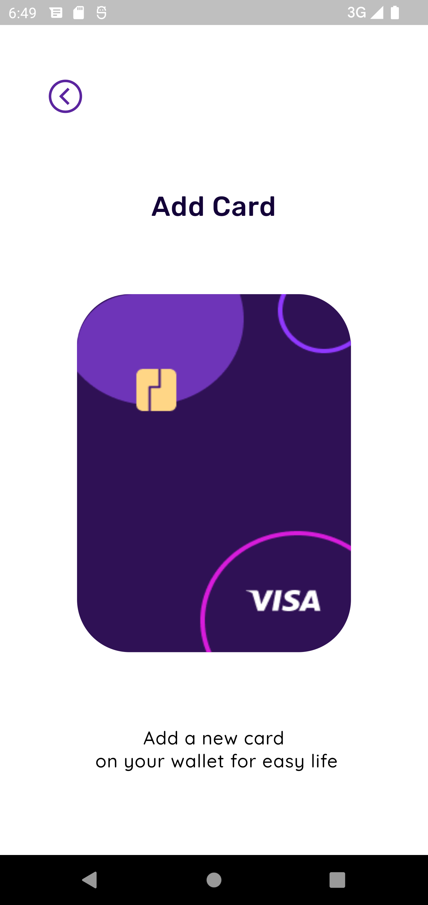
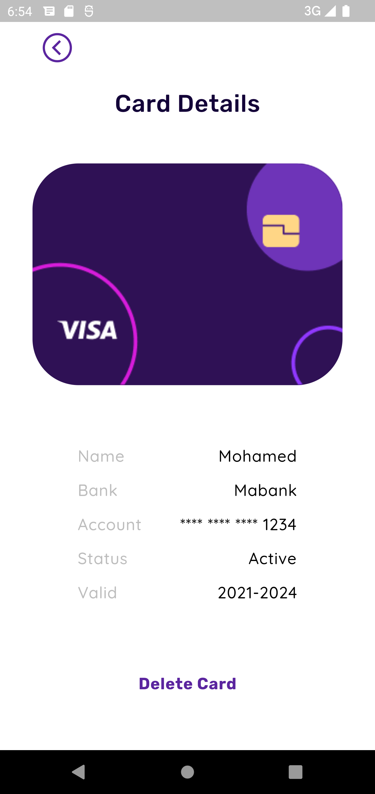
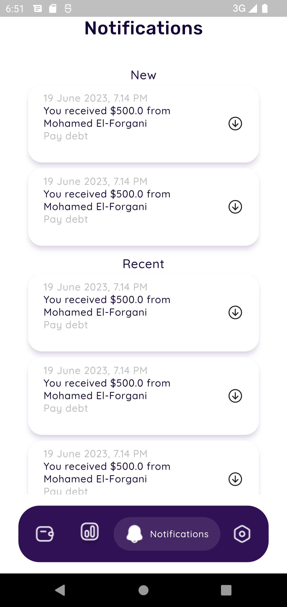
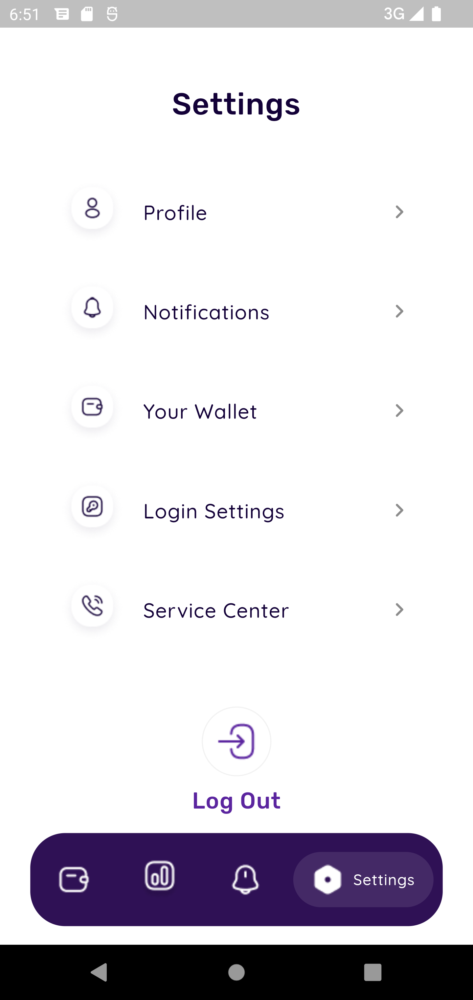
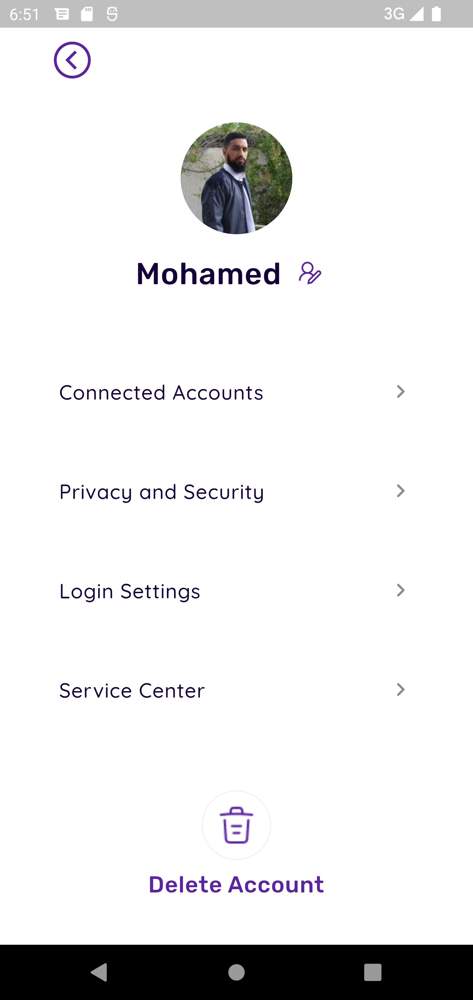

<h1 align = "center">Wallet App UI</h1>

A Wallet app is an UI built using Flutter, The App is responsive I used flutter_screenutil Package. Tried to make the code clean!!

<h2> Screenshots From App:</h2>
<table align="center">
  <tr>
    <td></td>
    <td></td>
    <td>
  </tr>
  <tr>
    <td></td>
         <td></td>
    <td></td>
  </tr>
  <tr >
        <td>
    <td></td>
  </tr>
</table>

